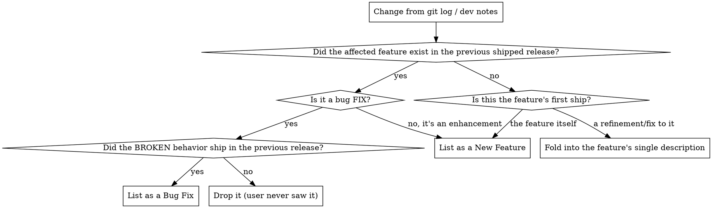

# Release Notes (Agent Sessions)

## CHANGELOG vs. release notes (read first)

These are two different documents with opposite jobs. Do not apply this skill to the first one.

| | **CHANGELOG** (`docs/CHANGELOG.md`) | **Release notes** (README "What's New", GitHub release, Sparkle, website) |
|---|---|---|
| Audience | Internal / maintainers (but the curated top feeds users) | Users |
| Job | Working **development history** + a curated release section | The **net change** a user sees on update |
| Granularity | Granular bullets while in `[Unreleased]`; curated headings at release | Curated, collapsed, headline-first |
| This skill | Governs its **curated section** (Highlights/Features/Bug Fixes); leaves the granular working bullets alone | **Governs all of it** |

The CHANGELOG is both the **source history** and the **origin of the derived notes** — because the deploy tool generates Sparkle/GitHub notes *from* it (see "How the derived notes are generated"). While developing, `[Unreleased]` may hold flat granular bullets; that's fine. At release, you curate that section into structured headings by applying the rule below. Don't delete real history — demote it to `### Improvements`. Everything below is the curation rule.

## Overview

Release notes describe the **net change from the last shipped release to this one** — the delta a user actually experiences when they update. They are **not** a replay of the CHANGELOG, and **not** a log of the work done during the cycle.

**Core principle: ship the destination, not the journey.** A user who updates from `X` to `Y` never saw any intermediate state. Everything that was built, refined, redesigned, and fixed *between* `X` and `Y` and never shipped to them is invisible — and must stay invisible in the notes.

This is the single rule most release notes get wrong, because the author lists what they *worked on* (commits, effort) instead of what *changed for the user* (the diff between two shipped versions).

## The Iron Rule

> **A change earns a line only if it is observable as a difference between the previous shipped release and this one.**

Two direct consequences:

1. **A feature that did not exist in the previous release collapses to one description.** Every refinement, "redesign," layout pass, polish commit, and bug fix made *to that feature during this cycle* folds into the feature's description. The user never had the rough version, so there is nothing to "fix" or "redesign" from their point of view. List the feature once, as it ships.

2. **A bug fix earns a line only if the broken behavior shipped in the previous release.** If the bug was introduced *and* fixed within this cycle, the user never received it — drop it. Pre-release stabilization, validation fixes, and "fixed the thing we just built" are not user-facing bug fixes.

**Violating the letter of this rule violates the spirit of it.** "But we worked really hard on the runway toolbar" is effort, not a user-visible delta. Effort does not earn a line.

## Decision: does this change earn a line?



To answer "did it exist in the previous release," read the previous release's own notes (CHANGELOG entry for the last tag) — not the current branch.

## Output recipe

Group by **impact**, then by **kind**. Drop everything trivial or internal.

```markdown
## 🚀 New Features
### Major      — headline; the reasons someone updates
### Moderate   — visible, welcome, not headline

## 🐞 Bug Fixes   (only behavior that shipped broken in the previous release)
### Major      — crashes, hangs, data loss, wrong results
### Moderate   — visible glitches, papercuts
```

Rules for the body:
- **Lead with the headline.** The first Major feature is why the release exists.
- **User-facing voice.** "Recover Codex side chats as searchable rows," not "fix: async cache side chat discovery."
- **One line per delta**, collapsing all the commits behind it.
- **Name new providers/agents** and what they unlock.

## Always drop (never user-facing)

- Internal cleanup, refactors, dead-code removal, renames of internal symbols
- Test additions/hardening, fixture updates, CI, merge commits
- Pre-release stabilization and "fixed what we just built this cycle"
- Dev-cycle redesigns/polish of a feature that is new this release
- Anything whose only audience is the developer

## Worked example (the failure this skill encodes)

Cycle shipped a brand-new **Session Runway** feature. The git log held ~15 commits: `add per-agent Claude runway`, `move runway controls into toolbar pills`, `refine runway controls`, `runway bars scale relatively`, `stabilize runway row presence`, `prefer Claude Desktop titles`, etc.

**Wrong (journey):** a "Session Runway" feature bullet **plus** a separate "Quota Meter toolbar redesign" feature **plus** bug-fix lines for "bars no longer render full-width," "rows appear before samples," "row presence stabilized."

**Right (destination):** one bullet —
> **Session Runway** — live per-session burn-rate bars showing which active Codex and Claude sessions are eating your plan and how long until reset.

The toolbar, the bars, the row behavior were never separate user experiences; they are *how Session Runway ships*. Zero bug-fix lines, because no user ever had the broken intermediate versions.

## Rationalization table

| Excuse | Reality |
|--------|---------|
| "We put a lot of work into the toolbar redesign" | Effort isn't a delta. The user only sees the final feature once. |
| "It was genuinely broken and we fixed it" | If the break never shipped, the user never saw it. Drop it. |
| "The CHANGELOG already lists all 30 bullets" | Correct — that's its job. The CHANGELOG is the granular source; you derive curated notes *from* it. Don't paste it into README/GitHub/Sparkle. |
| "It's a separate component, so a separate line" | Same-release sub-parts of a new feature collapse into that feature. |
| "Listing more shows how much we did" | Padding buries the headline and reads as churn. Fewer, truer lines land harder. |
| "It's technically a different subsystem" | The user doesn't see subsystems. Group by what they experience. |

## Red flags — STOP, you're logging the journey

- A bullet that paraphrases a commit message
- Two feature bullets that are really one feature + its own toolbar/layout
- A "Bug Fixes" line for something introduced this same cycle
- "redesign / refine / polish / stabilize / rework" describing a feature that's new this release
- More than ~2–3 lines tracing the evolution of a single new feature

**All of these mean: collapse to the shipped delta, or drop.**

## How the derived notes are generated

The `deploy` tool **generates the Sparkle and GitHub release notes from `docs/CHANGELOG.md`** — it does not read the README or this conversation. It leads with the release section's `### Highlights`, then `### Features` / `### Bug Fixes`, and summarizes the rest as "Other changes." So the curated net-change view has to live **inside the CHANGELOG release section**, in the established heading structure:

```markdown
## [X.Y] - YYYY-MM-DD
### Highlights      ← 1–4 curated headliners; the reasons to update. Sparkle/GitHub LEAD with these.
### Features        ← curated new features (Iron Rule applied — one line per feature)
### Bug Fixes       ← ONLY behavior that shipped broken in the previous release
### Improvements    ← secondary user-visible deltas that didn't earn a headline
```

That is how the CHANGELOG stays the source **and** yields correct derived notes:

1. **During development** — `[Unreleased]` may accumulate flat granular bullets. Leave them; that's the working history.
2. **At release** — restructure `[Unreleased]` into the headings above by applying the Iron Rule: collapse each new feature's refinements/fixes into one `### Features` line, keep only previously-shipped breakage in `### Bug Fixes`, move secondary deltas to `### Improvements`, and **drop pure internal churn** (tests, refactors, merges, pre-release fixes). Demote — don't delete — real history you want to keep.
3. **README "What's New" and the GitHub release** reuse the `### Highlights` + `### Features` content. They must not diverge from what the generator emits.

**If the generated Sparkle preview leads with the wrong thing, lists pre-release fixes, or buries the headline — fix the CHANGELOG section's `### Highlights`/`### Bug Fixes`, not the preview.** The preview is a mirror of the section; edit the source.

## Relationship to deploy

The **deploy** skill owns the mechanics — the Sparkle approval gate, appcast, GitHub release, README/website copy locations. Its Sparkle gate enforces a subset of this rule ("don't list pre-release fixes users never received"); this skill is the full method for deciding what survives and for shaping the CHANGELOG section the generator consumes.
