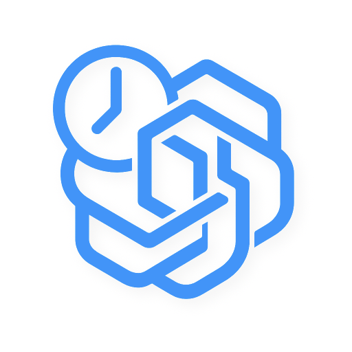
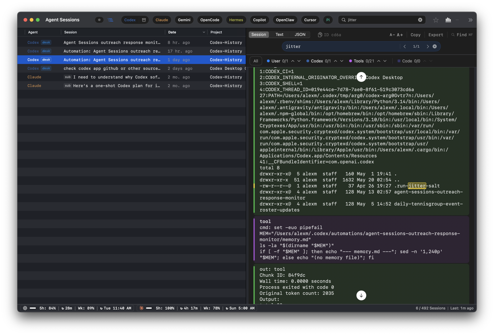
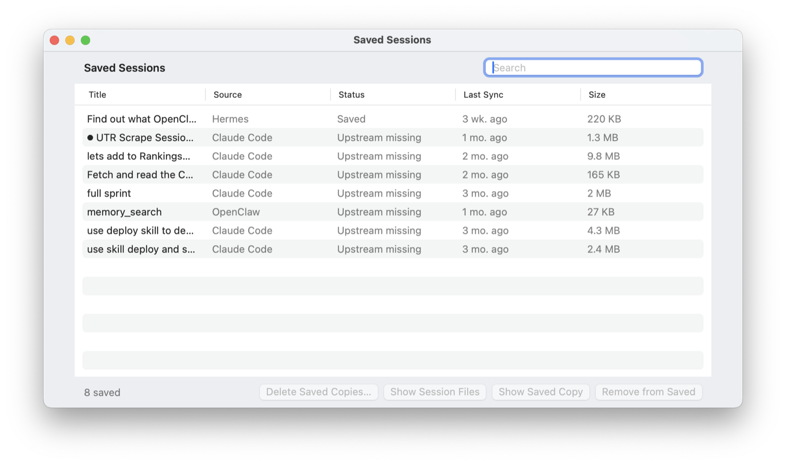
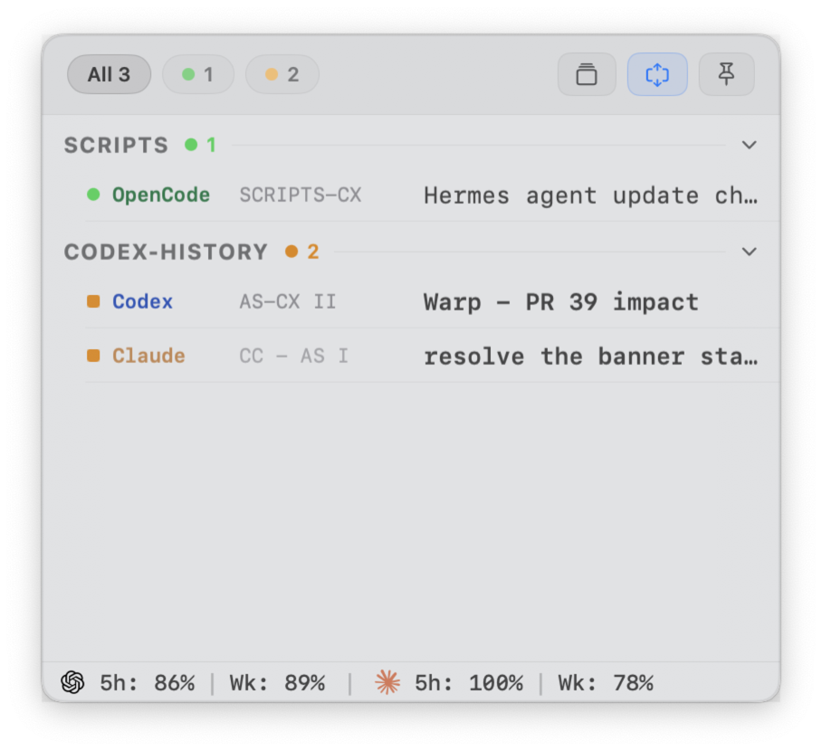

# Agent Sessions (macOS)

[](https://github.com/jazzyalex/agent-sessions/actions/workflows/ci.yml)

<table>
<tr>
<td width="100" align="center">
  
</td>
<td>

**Unified session browser for Codex CLI, Claude Code, Gemini CLI, GitHub Copilot CLI, Droid (Factory CLI), and OpenCode.**
Search, browse, and resume your past AI-coding sessions in a local-first macOS app.

</td>
</tr>
</table>

- Requires: macOS 14+
- License: MIT
- Security & Privacy: Local-only. No telemetry. Details: `docs/PRIVACY.md` and `docs/security.md`

<p align="center">
  <a href="https://github.com/jazzyalex/agent-sessions/releases/download/v3.3.1/AgentSessions-3.3.1.dmg"><b>Download Agent Sessions 3.3.1 (DMG)</b></a>
  •
  <a href="https://github.com/jazzyalex/agent-sessions/releases">All Releases</a>
  •
  <a href="#install">Install</a>
  •
  <a href="#resume-workflows">Resume Workflows</a>
  •
  <a href="#development">Development</a>
</p>

## Overview

Agent Sessions helps you search across large session histories, quickly find the right prompt/tool output, then reuse it by copying snippets or resuming supported sessions in your terminal.

<div align="center">
  <p style="margin:0 0 0px 0;"><em>Transcript view with search (Dark Mode)</em></p>
  

  <p style="margin:0 0 0px 0;"><em>Resume Codex CLI and Claude Code sessions</em></p>
  
</div>

## Agent Cockpit (Beta)

Agent Cockpit is the live command center for active iTerm2 Codex CLI, Claude Code, and OpenCode sessions, with shared active/waiting summaries and live Claude usage tracking.

<div align="center">
  <p style="margin:0 0 0px 0;"><em>Agent Cockpit</em></p>
  
</div>

## Agent Cockpit Setup

### Prerequisites

- Agent Sessions with Live Sessions enabled
- iTerm2
- Agents running in iTerm2

### Ideal Setup

- Set the iTerm window title to the repo name
- Run that repo's agents in that window
- Give each tab/session its own clear name
- Use the same name for the tab, session, and badge

### Layout

- One repo per desktop/Space if possible
- Or keep several on one desktop if you prefer
- Keep Agent Cockpit pinned in a corner so you can always see activity
- Click from the cockpit to jump straight to a session

## Core Features

- Agent Cockpit live HUD for active Codex CLI, Claude Code, and OpenCode iTerm2 sessions.
- Unified browsing across supported agents, with strict filtering and a single session list.
- Unified Search and image browsing across sessions, plus in-session Find for fast transcript navigation.
- Readable tool calls/outputs and navigation between prompts, tools, and errors.
- Local-only indexing designed for large histories.

## Documentation

- Release notes: `docs/CHANGELOG.md`
- Monthly summaries: `docs/summaries/`
- Privacy: `docs/PRIVACY.md`
- Security: `docs/security.md`
- Maintainers: `docs/deployment.md`

## Install

### Option A — Download DMG
1. [Download AgentSessions-3.3.1.dmg](https://github.com/jazzyalex/agent-sessions/releases/download/v3.3.1/AgentSessions-3.3.1.dmg)
2. Drag **Agent Sessions.app** into Applications.

### Option B — Homebrew
```bash
brew tap jazzyalex/agent-sessions
brew install --cask agent-sessions
```

### Automatic Updates (Sparkle)

Agent Sessions uses Sparkle for automatic updates (signed + notarized).

To force an update check (for testing):
```bash
defaults delete com.triada.AgentSessions SULastCheckTime
open "/Applications/Agent Sessions.app"
```

## Resume Workflows

- Open a session in your preferred terminal (Terminal.app or iTerm).
- Copy a session ID, command, or snippet to reuse in a new run.
- Use Unified Search (across sessions) and Find (within a session) to jump to relevant tool calls and outputs quickly.

## Privacy & Security

- Local-only. No telemetry.
- Reads agent session directories in read-only mode:
  - `~/.codex/sessions`
  - `~/.claude/sessions`
  - `~/.gemini/tmp`
  - `~/.copilot/session-state`
  - `~/.factory/sessions` and `~/.factory/projects`
  - `~/.local/share/opencode/opencode.db` and `~/.local/share/opencode/storage/session`
- Details: `docs/PRIVACY.md` and `docs/security.md`

---

## What's New in 3.3.1

TL;DR:
- **Critical update** for Codex users: fixes a 0% usage display bug and blocking-pipe issue that prevented Codex token tracking from working. Update immediately if you rely on Codex usage tracking.
- Copy Resume Command now available in the context menu for Claude, Codex, and OpenCode sessions.
- OpenCode session resume support added.

Highlights:
- **Critical Codex usage fix**: A 0% token display bug and blocking-pipe issue prevented Codex usage data from reaching the UI at all. This patch restores correct tracking.
- **Rate-limit resilience**: When the Codex CLI hits a rate limit, usage tracking now automatically falls back to the OAuth endpoint — data keeps flowing without interruption.
- **Copy Resume Command**: Right-click any Claude, Codex, or OpenCode session to copy the exact CLI command needed to resume it.
- **OpenCode resume**: OpenCode sessions now support resume from the context menu, matching Claude and Codex.

Details: `docs/CHANGELOG.md` and `docs/summaries/`.

## Development

Prerequisites:
- Xcode (macOS 14+)

Build:
```bash
xcodebuild -project AgentSessions.xcodeproj -scheme AgentSessions -configuration Debug -destination 'platform=macOS' build
```

Tests:
```bash
xcodebuild -project AgentSessions.xcodeproj -scheme AgentSessionsTests -destination 'platform=macOS' test
```

Contributing:
- `CONTRIBUTING.md`

## License

MIT. See `LICENSE`.
