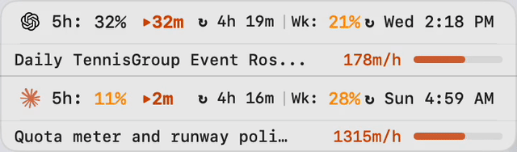

# Agent Sessions (macOS)

[](https://github.com/jazzyalex/agent-sessions/actions/workflows/ci.yml)

<table>
<tr>
<td width="100" align="center">
  
</td>
<td>

**Session management for [Codex](docs/guides/codex-local-history.html), [Claude](docs/guides/claude-code-jsonl-history.html), [OpenCode](docs/guides/opencode-sqlite-history.html), [Cursor](docs/guides/cursor-agent-local-history.html), GitHub Copilot CLI, Pi, Antigravity CLI, [Hermes](docs/guides/hermes-agent-state-db-history.html), and [OpenClaw](docs/guides/openclaw-local-agent-history.html) on macOS.**
Search, inspect, save, and resume local AI-coding sessions from CLI tools, desktop apps, and IDE agent surfaces.

</td>
</tr>
</table>

- Requires: macOS 14+
- License: MIT
- Security & Privacy: Local-only. No telemetry. Details: `docs/PRIVACY.md` and `docs/security.md`

<p align="center">
  <a href="https://github.com/jazzyalex/agent-sessions/releases/download/v4.4/AgentSessions-4.4.dmg"><b>Download Agent Sessions 4.4 (DMG)</b></a>
  •
  <a href="https://github.com/jazzyalex/agent-sessions/releases">All Releases</a>
  •
  <a href="#install">Install</a>
  •
  <a href="#resume-workflows">Resume Workflows</a>
  •
  <a href="#development">Development</a>
</p>

> **New in 4.4** — Codex usage keeps working when OpenAI pauses the 5-hour limit: Agent Sessions detects the change, shows a calm "no limit" for 5h while keeping your weekly usage accurate, and the Session Runway shows honest per-session token throughput instead of a misleading rate. [See what's new ↓](#whats-new-in-44)

## Overview

Agent Sessions is a local-first Mac app for finding useful work that coding agents already wrote to disk. It brings Codex, Claude, OpenCode, Cursor Agent, Hermes, OpenClaw, Antigravity, GitHub Copilot CLI, and Pi histories into one searchable view, with transcript inspection, image browsing, saved-session recovery, and resume commands for supported CLIs.

<div align="center">
  <p style="margin:0 0 0px 0;"><em>New in 4.0 — Session Runway: live per-session quota burn-rate</em></p>
  

  <p style="margin:0 0 0px 0;"><em>Sessions search with transcript and image preview</em></p>
  <picture>
    <source media="(prefers-color-scheme: dark)" srcset="docs/assets/session-all-agents-dark.png">
    
  </picture>

  <p style="margin:0 0 0px 0;"><em>Saved Sessions with restore actions</em></p>
  <picture>
    <source media="(prefers-color-scheme: dark)" srcset="docs/assets/saved-sessions-dark.png">
    
  </picture>

  <p style="margin:0 0 0px 0;"><em>Image Browser for visual session outputs</em></p>
  <picture>
    <source media="(prefers-color-scheme: dark)" srcset="docs/assets/image-browser-dark.png">
    
  </picture>
</div>

## Security & Privacy

- Local-first: session data stays on your Mac.
- No telemetry, analytics, remote logging, advertising identifiers, or session-history uploads.
- Reads local session folders you choose, plus supported default CLI locations.
- Builds local indexes/databases for search and navigation.
- Explicit actions may open Terminal/iTerm2 resume commands or run status/probe cleanup workflows.
- The only network activity is optional Sparkle update checks.

Details: `docs/PRIVACY.md` and `docs/security.md`.

## What's New in 4.4

**TL;DR** - Codex usage keeps working when OpenAI pauses the 5-hour limit. Agent Sessions detects the change, shows a calm "no limit" for 5h while keeping your weekly usage accurate, and the Session Runway shows honest per-session token throughput instead of a misleading rate.

**Highlights:** OpenAI temporarily removed Codex's 5-hour rate-limit window, which left the Quota Meter mislabeling weekly usage as "5h" with the wrong reset. Agent Sessions now recognizes this automatically — the 5h line reads a calm **"no limit"**, your **weekly** usage stays accurate, and it snaps back on its own when OpenAI restores the window. With no 5-hour budget to measure against, each active Codex session's runway now shows its real **token throughput** (e.g. `412K tk/h`) instead of a burn rate scaled to the wrong window, and a new **format guardrail** shows "can't verify" rather than a wrong number if a provider changes its usage data unexpectedly.

New in 4.4:
- **Codex 5-hour drop handled** — auto-detects when OpenAI pauses the 5h window; shows "no limit" for 5h, keeps weekly accurate, and self-recovers when it returns.
- **Honest Session Runway for Codex** — active sessions show real token throughput (`412K tk/h`) while the 5h window is gone; reverts to the familiar 5h "m/h" once it's back.
- **Format guardrail** — shows "can't verify" instead of a wrong number when a provider's usage format changes unexpectedly.

Previous release — 4.3.2: A much quieter Quota Meter. Full history in the [changelog](docs/CHANGELOG.md).

## What's New in 4.3.2

**TL;DR** - A much quieter Quota Meter. The usage meters no longer re-read and re-parse your entire session history every few seconds while idle, so your Mac stays cool and quiet — plus a more resilient Claude Web API path and a calm state for expired logins.

**Highlights:** The usage surfaces used to re-parse the whole session corpus on every 5-second refresh; they now cache each file's parse, cutting idle CPU from roughly 25–41% down to about 11% (measured on Release). The "active burn" shimmer pauses when nothing is burning and honors **Reduce Motion**. On the Claude side, the Web API path is far more resilient — it surfaces a Full Disk Access problem clearly instead of failing silently, recovers from retries instead of stalling, and adds a **Test Web API** self-check in Preferences. An idle, expired Claude token now shows a calm "no active session" state instead of a misleading error.

New in 4.3.2:
- **A much quieter Quota Meter** — usage meters cache each file's parse instead of re-reading your whole history every 5 seconds, cutting idle CPU from ~25–41% to ~11%.
- **Reduce Motion aware** — the "active burn" shimmer runs only while a session is burning and honors the system Reduce Motion setting.
- **Resilient Claude Web API** — a Full Disk Access problem now shows a clear cause instead of failing silently, retries recover instead of stalling, and a new **Test Web API** button runs an end-to-end self-check.
- **Calm expired state** — an idle, expired Claude token shows "no active session" instead of a misleading error.

Previous release — 4.3.1: A rebuilt first run and one-click "Fix" for usage tracking. Full history in the [changelog](docs/CHANGELOG.md).

## Core Features

- Browse and search [Codex CLI, Codex Desktop, and Codex VS Code sessions](docs/guides/codex-local-history.html) in one place.
- Browse [Claude CLI and Claude Desktop sessions](docs/guides/claude-code-jsonl-history.html) with consistent labels and project context.
- Browse [Cursor Agent transcripts](docs/guides/cursor-agent-local-history.html) from Cursor's local storage, enriched with Cursor chat metadata when available.
- [Hermes Agent sessions](docs/guides/hermes-agent-state-db-history.html) participate in browsing, search, filtering, analytics, and resume workflows, including current `~/.hermes/state.db` storage.
- [OpenClaw sessions](docs/guides/openclaw-local-agent-history.html) participate in browsing, search, filtering, deleted-session visibility, and resume workflows while ignoring trajectory traces.
- Pi CLI sessions now participate in browsing, search, filtering, and resume workflows.
- Unified browsing across supported agents, with strict filtering, saved sessions, and a single session list.
- Unified Search and Image Browser across sessions, plus in-session Find for fast transcript navigation.
- Readable tool calls/outputs and navigation between prompts, tools, and errors.
- Right-click Copy Resume Command or Resume for supported CLI sessions, with Terminal.app, iTerm2, and Warp launch targets.
- Agent Cockpit is the live command center for active Codex CLI, Claude CLI, and OpenCode CLI iTerm2 sessions, with a compact Quota Meter for always-on Codex and Claude usage visibility, freshness diagnostics, and projected run-out alerts.
- Local-only indexing designed for large histories.

## Agent Cockpit (Beta)

Agent Cockpit is the live command center for active iTerm2 [Codex CLI](docs/guides/codex-local-history.html), [Claude CLI](docs/guides/claude-code-jsonl-history.html), and [OpenCode CLI](docs/guides/opencode-sqlite-history.html) sessions, with shared active/waiting summaries and live Claude usage tracking.

<div align="center">
  <p style="margin:0 0 0px 0;"><em>Quota Meter with Session Runway per-session burn</em></p>
  

  <p style="margin:0 0 0px 0;"><em>Agent Cockpit</em></p>
  
</div>

## Agent Cockpit Setup

### Prerequisites

- Agent Sessions with Live Sessions enabled
- iTerm2
- Agents running in iTerm2

### Ideal Setup

- Set the iTerm window title to the repo name
- Run that repo's agents in that window
- Give each tab/session its own clear name
- Use the same name for the tab, session, and badge

### Layout

- One repo per desktop/Space if possible
- Or keep several on one desktop if you prefer
- Keep Agent Cockpit pinned in a corner so you can always see activity
- Click from the cockpit to jump straight to a session

## Install

### Option A — Download DMG
1. [Download AgentSessions-4.4.dmg](https://github.com/jazzyalex/agent-sessions/releases/download/v4.4/AgentSessions-4.4.dmg)
2. Drag **Agent Sessions.app** into Applications.

### Option B — Homebrew
```bash
brew tap jazzyalex/agent-sessions
brew install --cask agent-sessions
```

### Automatic Updates (Sparkle)

Agent Sessions uses Sparkle for automatic updates (signed + notarized).

To force an update check (for testing):
```bash
defaults delete com.triada.AgentSessions SULastCheckTime
open "/Applications/Agent Sessions.app"
```

## Documentation

- Guides:
  - [Codex local history: search Codex CLI, Desktop, and VS Code sessions](docs/guides/codex-local-history.html)
  - [OpenCode SQLite history: browsing old runs](docs/guides/opencode-sqlite-history.html)
  - [Claude Code JSONL history: what you can recover locally](docs/guides/claude-code-jsonl-history.html)
  - [Cursor Agent local history: search Cursor Agent transcripts](docs/guides/cursor-agent-local-history.html)
  - [Hermes Agent state database history](docs/guides/hermes-agent-state-db-history.html)
  - [OpenClaw local agent history](docs/guides/openclaw-local-agent-history.html)
- Release notes: `docs/CHANGELOG.md`
- Monthly summaries: `docs/summaries/`
- Privacy: `docs/PRIVACY.md`
- Security: `docs/security.md`
- Maintainers: `docs/deployment.md`

## Resume Workflows

- Right-click any supported CLI session and choose **Copy Resume Command** to get the exact CLI command for that session.
- Open supported Resume sessions in your preferred terminal: Terminal.app, iTerm2, or Warp.
- Use Unified Search (across sessions) and Find (within a session) to jump to relevant tool calls and outputs quickly.

## Privacy & Security

- Local-only. No telemetry.
- Reads agent session directories in read-only mode:
  - `~/.codex/sessions`
  - `~/.claude/projects`
  - `~/.gemini/antigravity/brain`
  - `~/.copilot/session-state`
  - `~/.cursor/projects` and `~/.cursor/chats`
  - `~/.factory/sessions` and `~/.factory/projects`
  - `~/.hermes/state.db` and `~/.hermes/sessions`
  - `~/.openclaw/agents` and legacy `~/.clawdbot/agents`
  - `~/.pi/agent/sessions`
  - `~/.local/share/opencode/opencode.db` and `~/.local/share/opencode/storage/session`
- Details: `docs/PRIVACY.md` and `docs/security.md`

## Development

Prerequisites:
- Xcode (macOS 14+)

Build:
```bash
xcodebuild -project AgentSessions.xcodeproj -scheme AgentSessions -configuration Debug -destination 'platform=macOS' build
```

Tests:
```bash
xcodebuild -project AgentSessions.xcodeproj -scheme AgentSessionsTests -destination 'platform=macOS' test
```

Contributing:
- `CONTRIBUTING.md`

## License

MIT. See `LICENSE`.
