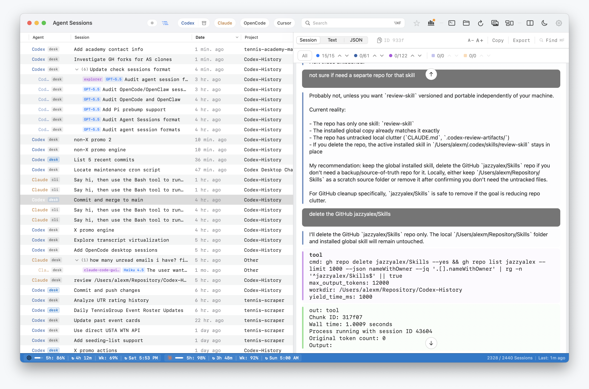
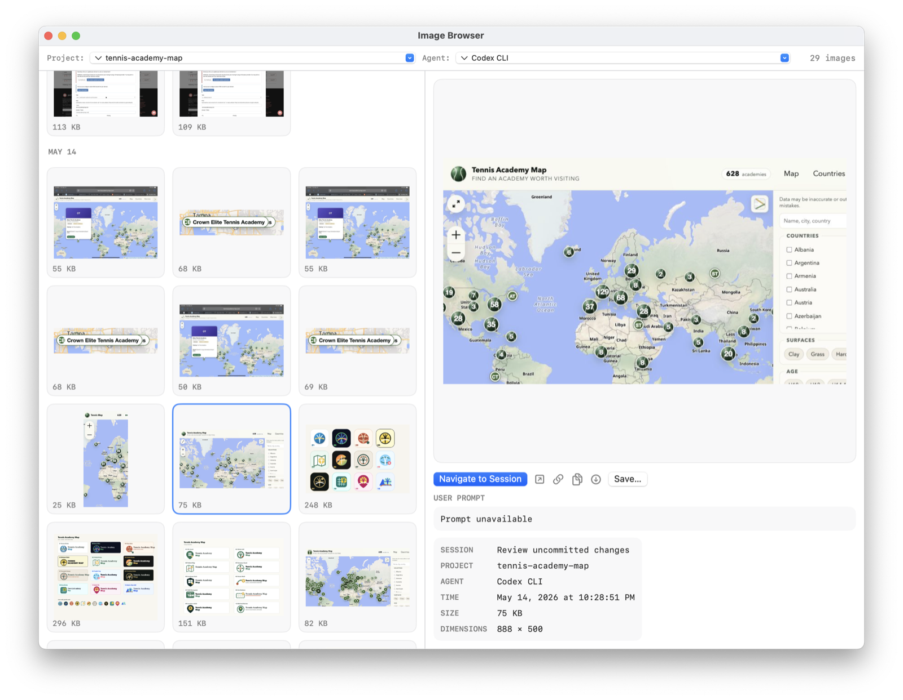
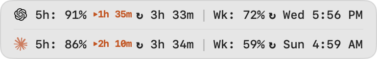

# Agent Sessions (macOS)

[](https://github.com/jazzyalex/agent-sessions/actions/workflows/ci.yml)

<table>
<tr>
<td width="100" align="center">
  
</td>
<td>

**Session management for [Codex](docs/guides/codex-local-history.html), [Claude](docs/guides/claude-code-jsonl-history.html), [OpenCode](docs/guides/opencode-sqlite-history.html), [Cursor](docs/guides/cursor-agent-local-history.html), GitHub Copilot CLI, Pi, Antigravity, [Hermes](docs/guides/hermes-agent-state-db-history.html), and [OpenClaw](docs/guides/openclaw-local-agent-history.html) on macOS.**
Search, inspect, save, and resume local AI-coding sessions from CLI tools, desktop apps, and IDE agent surfaces.

</td>
</tr>
</table>

- Requires: macOS 14+
- License: MIT
- Security & Privacy: Local-only. No telemetry. Details: `docs/PRIVACY.md` and `docs/security.md`

<p align="center">
  <a href="https://github.com/jazzyalex/agent-sessions/releases/download/v4.0/AgentSessions-4.0.dmg"><b>Download Agent Sessions 4.0 (DMG)</b></a>
  •
  <a href="https://github.com/jazzyalex/agent-sessions/releases">All Releases</a>
  •
  <a href="#install">Install</a>
  •
  <a href="#resume-workflows">Resume Workflows</a>
  •
  <a href="#development">Development</a>
</p>

## Overview

Agent Sessions is a local-first Mac app for finding useful work that coding agents already wrote to disk. It brings Codex, Claude, OpenCode, Cursor Agent, Hermes, OpenClaw, Antigravity, GitHub Copilot CLI, and Pi histories into one searchable view, with transcript inspection, image browsing, saved-session recovery, and resume commands for supported CLIs.

<div align="center">
  <p style="margin:0 0 0px 0;"><em>Sessions search with transcript and image preview</em></p>
  <picture>
    <source media="(prefers-color-scheme: dark)" srcset="docs/assets/session-all-agents-dark.png">
    
  </picture>

  <p style="margin:0 0 0px 0;"><em>Saved Sessions with restore actions</em></p>
  <picture>
    <source media="(prefers-color-scheme: dark)" srcset="docs/assets/saved-sessions-dark.png">
    
  </picture>

  <p style="margin:0 0 0px 0;"><em>Image Browser for visual session outputs</em></p>
  <picture>
    <source media="(prefers-color-scheme: dark)" srcset="docs/assets/image-browser-dark.png">
    
  </picture>
</div>

## Security & Privacy

- Local-first: session data stays on your Mac.
- No telemetry, analytics, remote logging, advertising identifiers, or session-history uploads.
- Reads local session folders you choose, plus supported default CLI locations.
- Builds local indexes/databases for search and navigation.
- Explicit actions may open Terminal/iTerm2 resume commands or run status/probe cleanup workflows.
- The only network activity is optional Sparkle update checks.

Details: `docs/PRIVACY.md` and `docs/security.md`.

## What's New in 4.0

**TL;DR** - The Quota Meter takes center stage with **Session Runway** — see in real time which sessions are burning your Codex and Claude quota. Plus recoverable Codex Side Chats, the new Antigravity provider replacing Gemini CLI, and visibility + restore for archived Claude sessions.

**Highlights:** The **Quota Meter** shows at a glance how much of your Codex and Claude 5h and weekly limits is left and when it resets. Its marquee 4.0 addition, **Session Runway**, adds live per-session burn-rate bars so you can spot which active session is eating your quota fastest before it costs you the window.

Also new in 4.0:
- **Codex Side Chats** — recover Codex Desktop side chats as searchable session rows with their own `side` badge and parent context; filter with `#side` (and `#side phrase` to search within them).
- **Antigravity provider** — replaces Gemini CLI support; discovers Antigravity CLI session transcripts, resumes with `agy --conversation <id>`, tracks live sessions, and surfaces local screenshots in the transcript and image browser.
- **Claude Archived Sessions** — archived Claude Desktop sessions are now visible with an `archived` pill and an archived-only filter, and can be restored in place via a gated Restore from Archive action (off by default) in the transcript strip.
- **Transcript identity strip** — a compact strip showing session identity, `side`/`sub` labels, and parent context, so the transcript stays identifiable even when the list loses focus.
- **Claude dynamic workflows** — Claude Code's Workflow tool spawns subagents dynamically at runtime; those subagents now nest under the session that launched them with a `workflow` badge and a fan-out marker on the parent, instead of cluttering the list as standalone rows.
- **Unified Sessions performance** — fixed several hangs on large histories (full-payload SwiftUI diffing, Project-column JSON re-parsing, foreground-return rebuilds) and backgrounded side-chat discovery so big Codex logs no longer block refresh.
- **Claude usage accuracy** — OAuth/Web refreshes preserve recent hard-probe 5h limit/reset data, projected-exhaustion alerts use fractional usage, and Claude Code 2.x `/usage` gaps are treated as unavailable rather than false 0% readings.
- Maintenance: re-verified agent-format support across all supported CLIs (Codex, Claude, Antigravity, Copilot, OpenCode, Hermes, OpenClaw, Cursor, Pi), updating parsers where formats changed.

## Core Features

- Browse and search [Codex CLI, Codex Desktop, and Codex VS Code sessions](docs/guides/codex-local-history.html) in one place.
- Browse [Claude CLI and Claude Desktop sessions](docs/guides/claude-code-jsonl-history.html) with consistent labels and project context.
- Browse [Cursor Agent transcripts](docs/guides/cursor-agent-local-history.html) from Cursor's local storage, enriched with Cursor chat metadata when available.
- [Hermes Agent sessions](docs/guides/hermes-agent-state-db-history.html) participate in browsing, search, filtering, analytics, and resume workflows, including current `~/.hermes/state.db` storage.
- [OpenClaw sessions](docs/guides/openclaw-local-agent-history.html) participate in browsing, search, filtering, deleted-session visibility, and resume workflows while ignoring trajectory traces.
- Pi CLI sessions now participate in browsing, search, filtering, and resume workflows.
- Unified browsing across supported agents, with strict filtering, saved sessions, and a single session list.
- Unified Search and Image Browser across sessions, plus in-session Find for fast transcript navigation.
- Readable tool calls/outputs and navigation between prompts, tools, and errors.
- Right-click Copy Resume Command or Resume for supported CLI sessions, with Terminal.app, iTerm2, and Warp launch targets.
- Agent Cockpit is the live command center for active Codex CLI, Claude CLI, and OpenCode CLI iTerm2 sessions, with a compact Quota Meter for always-on Codex and Claude usage visibility, freshness diagnostics, and projected run-out alerts.
- Local-only indexing designed for large histories.

## Agent Cockpit (Beta)

Agent Cockpit is the live command center for active iTerm2 [Codex CLI](docs/guides/codex-local-history.html), [Claude CLI](docs/guides/claude-code-jsonl-history.html), and [OpenCode CLI](docs/guides/opencode-sqlite-history.html) sessions, with shared active/waiting summaries and live Claude usage tracking.

<div align="center">
  <p style="margin:0 0 0px 0;"><em>Quota Meter with Session Runway per-session burn</em></p>
  

  <p style="margin:0 0 0px 0;"><em>Agent Cockpit</em></p>
  
</div>

## Agent Cockpit Setup

### Prerequisites

- Agent Sessions with Live Sessions enabled
- iTerm2
- Agents running in iTerm2

### Ideal Setup

- Set the iTerm window title to the repo name
- Run that repo's agents in that window
- Give each tab/session its own clear name
- Use the same name for the tab, session, and badge

### Layout

- One repo per desktop/Space if possible
- Or keep several on one desktop if you prefer
- Keep Agent Cockpit pinned in a corner so you can always see activity
- Click from the cockpit to jump straight to a session

## Install

### Option A — Download DMG
1. [Download AgentSessions-4.0.dmg](https://github.com/jazzyalex/agent-sessions/releases/download/v4.0/AgentSessions-4.0.dmg)
2. Drag **Agent Sessions.app** into Applications.

### Option B — Homebrew
```bash
brew tap jazzyalex/agent-sessions
brew install --cask agent-sessions
```

### Automatic Updates (Sparkle)

Agent Sessions uses Sparkle for automatic updates (signed + notarized).

To force an update check (for testing):
```bash
defaults delete com.triada.AgentSessions SULastCheckTime
open "/Applications/Agent Sessions.app"
```

## Documentation

- Guides:
  - [Codex local history: search Codex CLI, Desktop, and VS Code sessions](docs/guides/codex-local-history.html)
  - [OpenCode SQLite history: browsing old runs](docs/guides/opencode-sqlite-history.html)
  - [Claude Code JSONL history: what you can recover locally](docs/guides/claude-code-jsonl-history.html)
  - [Cursor Agent local history: search Cursor Agent transcripts](docs/guides/cursor-agent-local-history.html)
  - [Hermes Agent state database history](docs/guides/hermes-agent-state-db-history.html)
  - [OpenClaw local agent history](docs/guides/openclaw-local-agent-history.html)
- Release notes: `docs/CHANGELOG.md`
- Monthly summaries: `docs/summaries/`
- Privacy: `docs/PRIVACY.md`
- Security: `docs/security.md`
- Maintainers: `docs/deployment.md`

## Resume Workflows

- Right-click any supported CLI session and choose **Copy Resume Command** to get the exact CLI command for that session.
- Open supported Resume sessions in your preferred terminal: Terminal.app, iTerm2, or Warp.
- Use Unified Search (across sessions) and Find (within a session) to jump to relevant tool calls and outputs quickly.

## Privacy & Security

- Local-only. No telemetry.
- Reads agent session directories in read-only mode:
  - `~/.codex/sessions`
  - `~/.claude/projects`
  - `~/.gemini/antigravity/brain`
  - `~/.copilot/session-state`
  - `~/.cursor/projects` and `~/.cursor/chats`
  - `~/.factory/sessions` and `~/.factory/projects`
  - `~/.hermes/state.db` and `~/.hermes/sessions`
  - `~/.openclaw/agents` and legacy `~/.clawdbot/agents`
  - `~/.pi/agent/sessions`
  - `~/.local/share/opencode/opencode.db` and `~/.local/share/opencode/storage/session`
- Details: `docs/PRIVACY.md` and `docs/security.md`

## Development

Prerequisites:
- Xcode (macOS 14+)

Build:
```bash
xcodebuild -project AgentSessions.xcodeproj -scheme AgentSessions -configuration Debug -destination 'platform=macOS' build
```

Tests:
```bash
xcodebuild -project AgentSessions.xcodeproj -scheme AgentSessionsTests -destination 'platform=macOS' test
```

Contributing:
- `CONTRIBUTING.md`

## License

MIT. See `LICENSE`.
