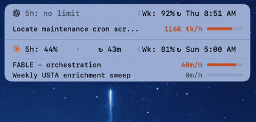

# Agent Sessions (macOS)

[](https://github.com/jazzyalex/agent-sessions/actions/workflows/ci.yml)

<table>
<tr>
<td width="100" align="center">
  
</td>
<td>

**Live per-session quota burn for Codex and Claude — see *which* session is eating your 5-hour and weekly limits, priced per model.**
Plus a searchable history across [Codex](docs/guides/codex-local-history.html), [Claude](docs/guides/claude-code-jsonl-history.html), [OpenCode](docs/guides/opencode-sqlite-history.html), [Cursor](docs/guides/cursor-agent-local-history.html), GitHub Copilot CLI, Pi, Antigravity CLI, [Hermes](docs/guides/hermes-agent-state-db-history.html), and [OpenClaw](docs/guides/openclaw-local-agent-history.html) — transcripts, images, and one-click resume. macOS, local-only.

</td>
</tr>
</table>

- Requires: macOS 14+
- License: MIT
- Security & Privacy: Local-only. No telemetry. Details: `docs/PRIVACY.md` and `docs/security.md`

<p align="center">
  <a href="https://github.com/jazzyalex/agent-sessions/releases/download/v4.6.3/AgentSessions-4.6.3.dmg"><b>Download Agent Sessions 4.6.3 (DMG)</b></a>
  •
  <a href="https://github.com/jazzyalex/agent-sessions/releases">All Releases</a>
  •
  <a href="#install">Install</a>
  •
  <a href="#resume-workflows">Resume Workflows</a>
  •
  <a href="#development">Development</a>
</p>

> **New in 4.6.3** — The footer usage meters can finally be switched off: the three toggles that used to claim to do this never did anything, and one switch replaces them. The usage-source note ("via claude.ai") also stops breaking the footer layout. [See what's new ↓](#whats-new-in-463)

## Overview

Run three agents at once and a normal quota meter tells you "60% used" — not which one spent it. Agent Sessions attributes burn to the **individual session**, live, against your Codex and Claude 5-hour and weekly windows. Pick the lens you want (5-hour, weekly, tokens/hour, or dollars); the `$` lens prices each model in a session at its own rate, so an Opus orchestrator driving Sonnet subagents is costed per model instead of blended into one number.

It's also a local-first Mac app for finding useful work coding agents already wrote to disk — Codex, Claude, OpenCode, Cursor Agent, Hermes, OpenClaw, Antigravity, GitHub Copilot CLI, and Pi histories in one searchable view, with transcript inspection, image browsing, saved-session recovery, and resume commands for supported CLIs.

<div align="center">
  <p style="margin:0 0 0px 0;"><em>Session Runway — live per-session quota burn-rate</em></p>
  

  <p style="margin:0 0 0px 0;"><em>Sessions search with transcript and image preview</em></p>
  <picture>
    <source media="(prefers-color-scheme: dark)" srcset="docs/assets/session-all-agents-dark.png">
    
  </picture>

  <p style="margin:0 0 0px 0;"><em>Saved Sessions with restore actions</em></p>
  <picture>
    <source media="(prefers-color-scheme: dark)" srcset="docs/assets/saved-sessions-dark.png">
    
  </picture>

  <p style="margin:0 0 0px 0;"><em>Image Browser for visual session outputs</em></p>
  <picture>
    <source media="(prefers-color-scheme: dark)" srcset="docs/assets/image-browser-dark.png">
    
  </picture>
</div>

## Security & Privacy

- Local-first: session data stays on your Mac.
- No telemetry, analytics, remote logging, advertising identifiers, or session-history uploads.
- Reads local session folders you choose, plus supported default CLI locations.
- Builds local indexes/databases for search and navigation.
- Explicit actions may open Terminal/iTerm2 resume commands or run status/probe cleanup workflows.
- The only network activity is optional Sparkle update checks and an optional read-only fetch of a public model-price list (for the runway's $ estimate) — neither sends any personal or session data.

Details: `docs/PRIVACY.md` and `docs/security.md`.

## What's New in 4.6.3

**TL;DR** - The footer usage meters can be switched off. Settings → Usage Tracking carried three toggles that claimed to control this and none of them did anything — they saved a value nothing read, and flipping usage tracking overwrote your choice anyway. One working switch replaces all three. The "via claude.ai" source note also stops pushing the footer out of line.

New in 4.6.3:
- **Show usage in the footer** — one switch, applied immediately, no relaunch. Tracking keeps running while it's off, so the menu bar and Quota Meter are unaffected; this only decides whether the main window repeats the same numbers.
- **Reset times are always shown** — they're part of reading a meter, so the footer no longer pretends that's optional. The menu bar keeps its own reset-indicator switches in its own menu.
- **The source note stays on one line** — a reading served by the claude.ai web path or the CLI probe used to be tagged on a second line underneath, which grew the fixed-height footer and shoved everything out of alignment.

**Recent releases** — 4.6.2: Codex guardian sessions nest under their parent instead of duplicating it. 4.6: paste-a-cookie Claude web usage, no CLI or Full Disk Access needed. 4.5: dollar burn per session, priced per model, and a Quota Meter that stays put. 4.4: Codex 5-hour drop handled with honest "no limit" and "can't verify" states. Full history in the [changelog](docs/CHANGELOG.md).

## Core Features

- Browse and search [Codex CLI, Codex Desktop, and Codex VS Code sessions](docs/guides/codex-local-history.html) in one place.
- Browse [Claude CLI and Claude Desktop sessions](docs/guides/claude-code-jsonl-history.html) with consistent labels and project context.
- Browse [Cursor Agent transcripts](docs/guides/cursor-agent-local-history.html) from Cursor's local storage, enriched with Cursor chat metadata when available.
- [Hermes Agent sessions](docs/guides/hermes-agent-state-db-history.html) participate in browsing, search, filtering, analytics, and resume workflows, including current `~/.hermes/state.db` storage.
- [OpenClaw sessions](docs/guides/openclaw-local-agent-history.html) participate in browsing, search, filtering, deleted-session visibility, and resume workflows while ignoring trajectory traces.
- Pi CLI sessions now participate in browsing, search, filtering, and resume workflows.
- Unified browsing across supported agents, with strict filtering, saved sessions, and a single session list.
- Unified Search and Image Browser across sessions, plus in-session Find for fast transcript navigation.
- Readable tool calls/outputs and navigation between prompts, tools, and errors.
- Right-click Copy Resume Command or Resume for supported CLI sessions, with Terminal.app, iTerm2, and Warp launch targets.
- Quota Meter with Session Runway shows **live burn rate per session** against your Codex and Claude 5-hour and weekly limits — in percent, tokens/hour, or dollars priced per model.
- Local-only indexing designed for large histories.

## Quota Meter — Session Runway

An ordinary quota meter says "60% used." It won't say which of your three running agents spent it. The Quota Meter attributes burn to the **individual session**, live, against your Codex and Claude 5-hour and weekly windows.

- **Per-session burn bars** — each active session gets its own rate against the live window, so you know which one to stop.
- **Four lenses** — 5-hour, weekly, tokens/hour, or dollars; chosen from the meter and remembered.
- **Priced per model** — the `$` lens rates each model in a session at its own rate, so an Opus orchestrator driving Sonnet subagents is costed at what each actually runs at rather than blended into one number.
- **Honest states** — a calm "no limit" when a provider drops a window, and "can't verify" rather than a wrong number if usage data changes shape.
- **Stays where you put it** — drag it anywhere, right-click for controls. Show or hide it from the View menu (⌘⌥⇧C).

<div align="center">
  
</div>

## Quota Meter Setup

### Prerequisites

- Agent Sessions with live session detection enabled
- Agents running in a terminal, or in Codex or Claude Desktop

### Ideal Setup

Session rows read best when your terminal names them clearly:

- Set the terminal window title to the repo name
- Run that repo's agents in that window
- Give each tab/session its own clear name
- Use the same name for the tab, session, and badge

### Layout

- One repo per desktop/Space if possible
- Or keep several on one desktop if you prefer
- Keep the Quota Meter pinned in a corner so you can always see activity

## Install

### Option A — Download DMG
1. [Download AgentSessions-4.6.3.dmg](https://github.com/jazzyalex/agent-sessions/releases/download/v4.6.3/AgentSessions-4.6.3.dmg)
2. Drag **Agent Sessions.app** into Applications.

### Option B — Homebrew
```bash
brew tap jazzyalex/agent-sessions
brew install --cask agent-sessions
```

### Automatic Updates (Sparkle)

Agent Sessions uses Sparkle for automatic updates (signed + notarized).

To force an update check (for testing):
```bash
defaults delete com.triada.AgentSessions SULastCheckTime
open "/Applications/Agent Sessions.app"
```

## Documentation

- Guides:
  - [Codex local history: search Codex CLI, Desktop, and VS Code sessions](docs/guides/codex-local-history.html)
  - [OpenCode SQLite history: browsing old runs](docs/guides/opencode-sqlite-history.html)
  - [Claude Code JSONL history: what you can recover locally](docs/guides/claude-code-jsonl-history.html)
  - [Cursor Agent local history: search Cursor Agent transcripts](docs/guides/cursor-agent-local-history.html)
  - [Hermes Agent state database history](docs/guides/hermes-agent-state-db-history.html)
  - [OpenClaw local agent history](docs/guides/openclaw-local-agent-history.html)
- Release notes: `docs/CHANGELOG.md`
- Monthly summaries: `docs/summaries/`
- Privacy: `docs/PRIVACY.md`
- Security: `docs/security.md`
- Maintainers: `docs/deployment.md`

## Resume Workflows

- Right-click any supported CLI session and choose **Copy Resume Command** to get the exact CLI command for that session.
- Open supported Resume sessions in your preferred terminal: Terminal.app, iTerm2, or Warp.
- Use Unified Search (across sessions) and Find (within a session) to jump to relevant tool calls and outputs quickly.

## Privacy & Security

- Local-only. No telemetry.
- Reads agent session directories in read-only mode:
  - `~/.codex/sessions`
  - `~/.claude/projects`
  - `~/.gemini/antigravity/brain`
  - `~/.copilot/session-state`
  - `~/.cursor/projects` and `~/.cursor/chats`
  - `~/.factory/sessions` and `~/.factory/projects`
  - `~/.hermes/state.db` and `~/.hermes/sessions`
  - `~/.openclaw/agents` and legacy `~/.clawdbot/agents`
  - `~/.pi/agent/sessions`
  - `~/.local/share/opencode/opencode.db` and `~/.local/share/opencode/storage/session`
- Details: `docs/PRIVACY.md` and `docs/security.md`

## Development

Prerequisites:
- Xcode (macOS 14+)

Build:
```bash
xcodebuild -project AgentSessions.xcodeproj -scheme AgentSessions -configuration Debug -destination 'platform=macOS' build
```

Tests:
```bash
xcodebuild -project AgentSessions.xcodeproj -scheme AgentSessionsTests -destination 'platform=macOS' test
```

Contributing:
- `CONTRIBUTING.md`

## License

MIT. See `LICENSE`.
