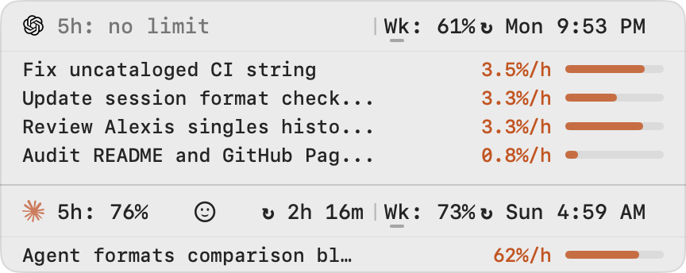

# Agent Sessions for macOS

[](https://github.com/jazzyalex/agent-sessions/actions/workflows/ci.yml)

## Find the agent session you need

Search local conversations from [Codex](https://jazzyalex.github.io/agent-sessions/guides/codex-local-history.html?campaign=github&ref=readme-guide), [Claude Code](https://jazzyalex.github.io/agent-sessions/guides/claude-code-jsonl-history.html?campaign=github&ref=readme-guide), [Cursor](https://jazzyalex.github.io/agent-sessions/guides/cursor-agent-local-history.html?campaign=github&ref=readme-guide), and **12 other coding agents** in one Mac app. Read the transcript, find supported image outputs, and resume supported CLI sessions. For Codex and Claude, see which sessions are burning through your quota.

Open source. Your session history stays on your Mac. No telemetry.

<p align="center">
  <a href="https://github.com/jazzyalex/agent-sessions/releases/download/v5.2/AgentSessions-5.2.dmg"><b>Download Agent Sessions 5.2</b></a>
  ·
  <a href="https://jazzyalex.github.io/agent-sessions/?campaign=github&ref=readme-demo">See the product page</a>
  ·
  <a href="https://github.com/jazzyalex/agent-sessions/releases">All releases</a>
</p>

```bash
brew install --cask jazzyalex/agent-sessions/agent-sessions
```

<p align="center">
  
</p>

<p align="center"><em>Search 15 local agent histories, resume supported sessions, and track Codex and Claude quota burn.</em></p>

## What it does

- **Find past work.** Search prompts, responses, tool calls, command output, errors, file paths, and supported image references across local agent histories.
- **Pick up where you left off.** Copy a resume command or open a supported CLI session in Terminal.app, iTerm2, or Warp.
- **See which session is burning your quota.** Track live per-session Codex and Claude burn against 5-hour and weekly windows; switch between quota, tokens, and estimated API-equivalent cost.
- **Keep transcripts on your Mac.** Agent Sessions builds its search index locally and does not upload session history.

## What's New in 5.2

- Agent Sessions is now available in English and Simplified Chinese, with an in-app invitation for established users to help add another language.
- Quota Meter weekly rates use stricter, recent evidence; Astra and Sol long-context pricing are included, and uncertain inputs fail closed.
- Session-list invitations wait for every enabled source to settle, respect dismissal consistently, and avoid repeating or rotating too quickly.

## Supported sources

Agent Sessions reads 14 active agent formats plus legacy Droid sessions. Capabilities differ by source and installed CLI version.

| Source | Browse and search | Resume |
|---|---:|---:|
| Codex | Yes | Supported sessions |
| Claude Code | Yes | Supported sessions |
| Cursor | Yes | Supported sessions |
| GitHub Copilot CLI | Yes | Supported sessions |
| OpenCode | Yes | Supported sessions |
| Antigravity | Yes | Supported sessions |
| Pi | Yes | Supported sessions |
| Kimi Code | Yes | Supported sessions |
| Grok CLI | Yes | Supported sessions |
| Hermes | Yes | Supported sessions |
| OpenClaw | Yes | No |
| Qwen Code | Yes | Active sessions; end-to-end unverified |
| Devin CLI | Yes | Supported active sessions |
| fx | Yes | Command plan tested; interactive reopen unverified |
| Droid | Legacy sessions | No active monitoring |

Format-maintenance owners, verification dates, and tested versions are in [STEWARDS.md](STEWARDS.md). [Session-Bench](https://jazzyalex.github.io/agent-sessions/bench/?campaign=github&ref=readme-bench) compares ten agents across 20 evidence-backed format gates.

## Quota Meter

An account meter can tell you that 60% is used. Agent Sessions shows which active Codex or Claude session is spending it.

- Per-session burn against available 5-hour and weekly windows.
- Four views: 5-hour, weekly, tokens per hour, and estimated API-equivalent dollars per hour.
- Per-model pricing when one session uses more than one model.
- Explicit unavailable states when a provider does not expose a usable limit.

The dollar view is an API-equivalent estimate, not your subscription bill.

<p align="center">
  
</p>

## Install

Download [AgentSessions-5.2.dmg](https://github.com/jazzyalex/agent-sessions/releases/download/v5.2/AgentSessions-5.2.dmg), open it, and drag **Agent Sessions.app** into Applications.

Or use Homebrew:

```bash
brew install --cask jazzyalex/agent-sessions/agent-sessions
```

Updates are signed, notarized, and delivered through Sparkle.

## Local-history guides

- [Find and search old Codex CLI, Desktop, and VS Code sessions](https://jazzyalex.github.io/agent-sessions/guides/codex-local-history.html?campaign=github&ref=readme-guide)
- [Find and search Claude Code JSONL history](https://jazzyalex.github.io/agent-sessions/guides/claude-code-jsonl-history.html?campaign=github&ref=readme-guide)
- [Search Cursor Agent transcripts](https://jazzyalex.github.io/agent-sessions/guides/cursor-agent-local-history.html?campaign=github&ref=readme-guide)
- [Browse OpenCode SQLite history](https://jazzyalex.github.io/agent-sessions/guides/opencode-sqlite-history.html?campaign=github&ref=readme-guide)
- [Browse GitHub Copilot CLI history](https://jazzyalex.github.io/agent-sessions/guides/copilot-cli-local-history.html?campaign=github&ref=readme-guide)
- [Browse Antigravity CLI history](https://jazzyalex.github.io/agent-sessions/guides/antigravity-cli-local-history.html?campaign=github&ref=readme-guide)
- [Browse Hermes Agent history](https://jazzyalex.github.io/agent-sessions/guides/hermes-agent-state-db-history.html?campaign=github&ref=readme-guide)
- [Browse OpenClaw history](https://jazzyalex.github.io/agent-sessions/guides/openclaw-local-agent-history.html?campaign=github&ref=readme-guide)

See the [changelog](docs/CHANGELOG.md), [privacy policy](docs/PRIVACY.md), and [security notes](docs/security.md).

## Privacy and network access

- Transcript discovery, parsing, indexing, search, and navigation happen locally.
- Agent session folders are read rather than rewritten.
- Explicit actions can open resume commands or manage saved copies.
- Optional network access checks for signed Sparkle updates and fetches a public model-price list. Neither request contains transcript data.

## Contributing

Missing your agent? Use the [new source form](https://github.com/jazzyalex/agent-sessions/issues/new?template=new-agent-source.yml). You can contribute a sanitized fixture without writing Swift, adopt an existing format as a steward, or follow the [contribution guide](docs/CONTRIBUTING.md).

Build locally with Xcode 16 or later:

```bash
xcodebuild -project AgentSessions.xcodeproj -scheme AgentSessions -configuration Debug -destination 'platform=macOS' build
```

Run the stable test wrapper:

```bash
./scripts/xcode_test_stable.sh
```

Found a session you thought you had lost? [Star Agent Sessions](https://github.com/jazzyalex/agent-sessions) to help other developers find it.

## License

MIT. See [LICENSE](LICENSE).
