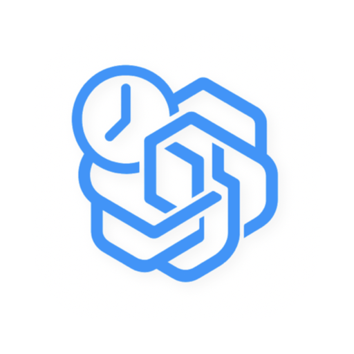
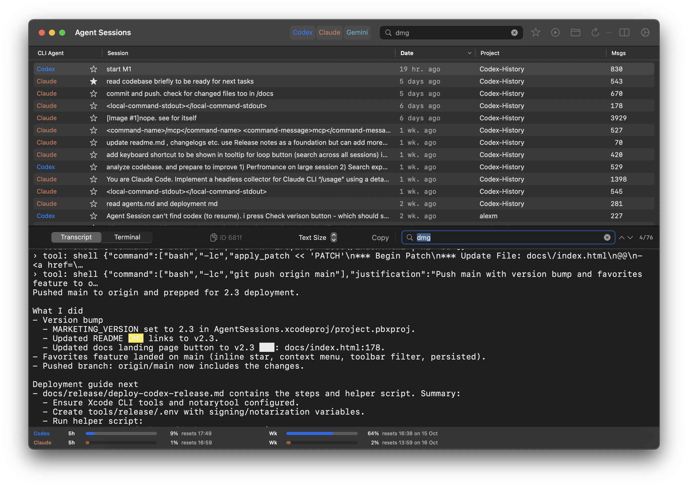
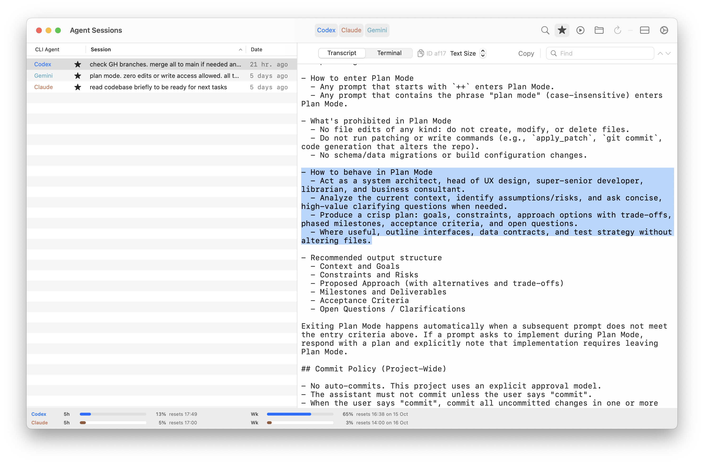

# Agent Sessions (macOS)

[](https://github.com/jazzyalex/agent-sessions/actions/workflows/ci.yml)

<table>
<tr>
<td width="100" align="center">
  
</td>
<td>

**Unified session browser for Codex CLI, Claude Code, Gemini CLI, GitHub Copilot CLI, Droid (Factory CLI), and OpenCode.**
Search, browse, and resume your past AI-coding sessions in a local-first macOS app.

</td>
</tr>
</table>

- Requires: macOS 14+
- License: MIT
- Security & Privacy: Local-only. No telemetry. Details: `docs/PRIVACY.md` and `docs/security.md`

<p align="center">
  <a href="https://github.com/jazzyalex/agent-sessions/releases/download/v2.11/AgentSessions-2.11.dmg"><b>Download Agent Sessions 2.11 (DMG)</b></a>
  •
  <a href="https://github.com/jazzyalex/agent-sessions/releases">All Releases</a>
  •
  <a href="#install">Install</a>
  •
  <a href="#resume-workflows">Resume Workflows</a>
  •
  <a href="#development">Development</a>
</p>

## Overview

Agent Sessions helps you search across large session histories, quickly find the right prompt/tool output, then reuse it by copying snippets or resuming supported sessions in your terminal.

<div align="center">
  <p style="margin:0 0 0px 0;"><em>Transcript view with search (Dark Mode)</em></p>
  

  <p style="margin:0 0 0px 0;"><em>Resume Codex CLI and Claude Code sessions</em></p>
  
</div>

## Core Features

- Unified browsing across supported agents, with strict filtering and a single session list.
- Unified Search across all sessions plus in-session Find for fast transcript navigation.
- Readable tool calls/outputs and navigation between prompts, tools, and errors.
- Local-only indexing designed for large histories.

## Documentation

- Release notes: `docs/CHANGELOG.md`
- Monthly summaries: `docs/summaries/`
- Privacy: `docs/PRIVACY.md`
- Security: `docs/security.md`
- Maintainers: `docs/deployment.md`

## Install

### Option A — Download DMG
1. [Download AgentSessions-2.11.dmg](https://github.com/jazzyalex/agent-sessions/releases/download/v2.11/AgentSessions-2.11.dmg)
2. Drag **Agent Sessions.app** into Applications.

### Option B — Homebrew
```bash
brew tap jazzyalex/agent-sessions
brew install --cask agent-sessions
```

### Automatic Updates (Sparkle)

Agent Sessions uses Sparkle for automatic updates (signed + notarized).

To force an update check (for testing):
```bash
defaults delete com.triada.AgentSessions SULastCheckTime
open "/Applications/Agent Sessions.app"
```

## Resume Workflows

- Open a session in your preferred terminal (Terminal.app or iTerm).
- Copy a session ID, command, or snippet to reuse in a new run.
- Use Unified Search (across sessions) and Find (within a session) to jump to relevant tool calls and outputs quickly.

## Privacy & Security

- Local-only. No telemetry.
- Reads agent session directories in read-only mode:
  - `~/.codex/sessions`
  - `~/.claude/sessions`
  - `~/.gemini/tmp`
  - `~/.copilot/session-state`
  - `~/.factory/sessions` and `~/.factory/projects`
  - `~/.local/share/opencode/storage/session`
- Details: `docs/PRIVACY.md` and `docs/security.md`

---

## What's New in 2.11

Short version:
- Major update: Added OpenClaw (clawdbot) session support, with Advanced visibility for deleted sessions.
- Major update: Expanded Images workflows with inline thumbnails in Session view and a faster, richer Image Browser.
- Major bug fix: Search coverage for some sessions is now more complete via incremental backfill and changed-file indexing.
- Major bug fix: Reduced Energy Warning spikes by replacing always-on idle work with activation/event-driven refresh and power-aware indexing/probing.
- OpenClaw transcript handling is cleaner, including better media-hint suppression and improved tool output formatting.
- Image Browser now includes Project/Agent filters, cached indexing, and richer image actions.

Details: `docs/CHANGELOG.md` and `docs/summaries/`.

## Development

Prerequisites:
- Xcode (macOS 14+)

Build:
```bash
xcodebuild -project AgentSessions.xcodeproj -scheme AgentSessions -configuration Debug -destination 'platform=macOS' build
```

Tests:
```bash
xcodebuild -project AgentSessions.xcodeproj -scheme AgentSessionsTests -destination 'platform=macOS' test
```

Contributing:
- `CONTRIBUTING.md`

## License

MIT. See `LICENSE`.
