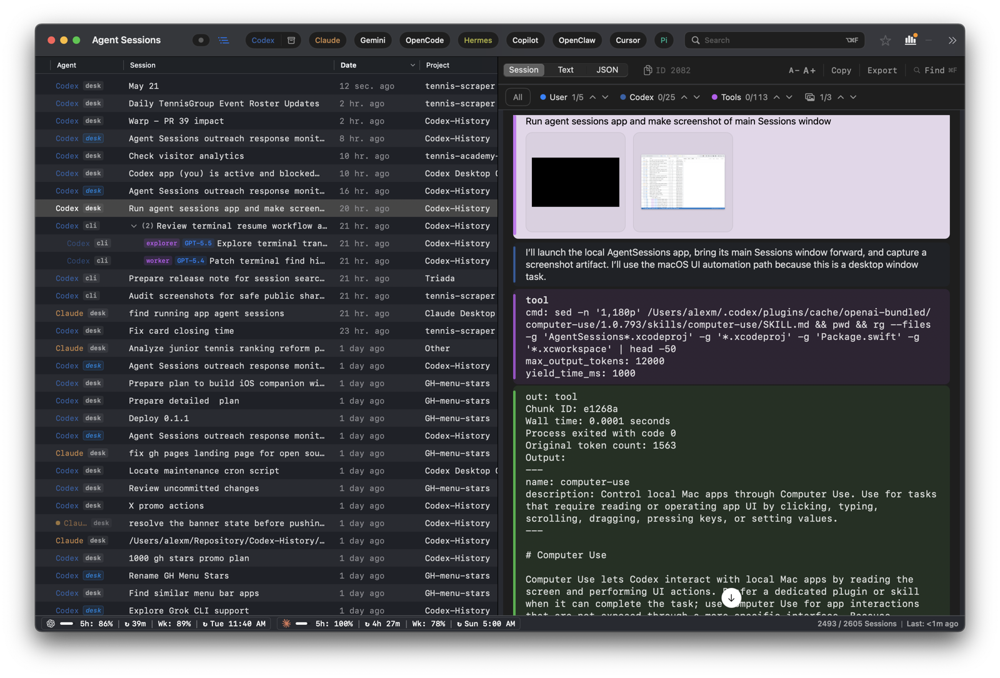

# Codex Local History: Search Codex CLI, Desktop, and VS Code Sessions on macOS

Codex sessions are often the record of how a task actually happened: the prompt, plan, tool call, patch output, command error, image input, or final reasoning boundary. Agent Sessions makes that local Codex history searchable on your Mac across Codex CLI, Codex Desktop, and Codex VS Code surfaces.

Agent Sessions reads local Codex rollout files. It does not upload Codex transcripts or turn them into hosted project memory.


## Where Codex Stores Local Data

Codex session logs use JSONL rollout files. The default root is:

```text
~/.codex/sessions
```

If `CODEX_HOME` is set, Agent Sessions follows:

```text
$CODEX_HOME/sessions
```

Codex stores sessions in date-sharded folders:

```text
YYYY/MM/DD/rollout-*.jsonl
```

Agent Sessions also scans archived Codex session folders when they exist, so restored or archived Codex Desktop sessions can remain visible.

## What Agent Sessions Does With Codex History

Agent Sessions turns local Codex history into a macOS session browser:

- Lists Codex CLI, Codex Desktop, and Codex VS Code sessions in one Codex corpus.
- Shows row-level surface labels such as CLI, Desktop, or VS Code when that metadata is available.
- Full-text searches old prompts, assistant text, tool calls, command output, errors, file paths, and image references.
- Keeps Codex rows labeled separately from Claude, Cursor Agent, OpenCode, Hermes, OpenClaw, Gemini, Copilot, and Pi.
- Supports archived Codex Desktop filtering and projectless Desktop chat grouping.
- Supports Codex resume workflows, including modern resume IDs and fallback `experimental_resume` paths for older flows.

## What This Does Not Do

Agent Sessions does not:

- Upload Codex transcripts to a hosted search service.
- Recover hidden model state that Codex never wrote locally.
- Decrypt opaque encrypted reasoning blobs.
- Replace Codex's own resume picker.
- Modify Codex rollout files.

It is a read-only browser over local session history that already exists on the Mac.

## When This Is Useful

This helps when:

- You need to find an old Codex command output or patch decision.
- You remember a file path, error, or prompt but not the session.
- You use Codex across CLI, Desktop, and VS Code surfaces.
- You want Codex history in the same browser as Claude Code, Cursor Agent, OpenCode, Hermes, OpenClaw, Gemini, Copilot, or Pi.



## Sources

- [Agent Sessions Codex discovery](../../AgentSessions/Services/SessionDiscovery.swift)
- [Codex session storage format](../session-storage-format.md)
- [Codex resume behavior](../codex-resume.md)
- [Agent Sessions support ledger](../agent-support/agent-support-ledger.yml)
